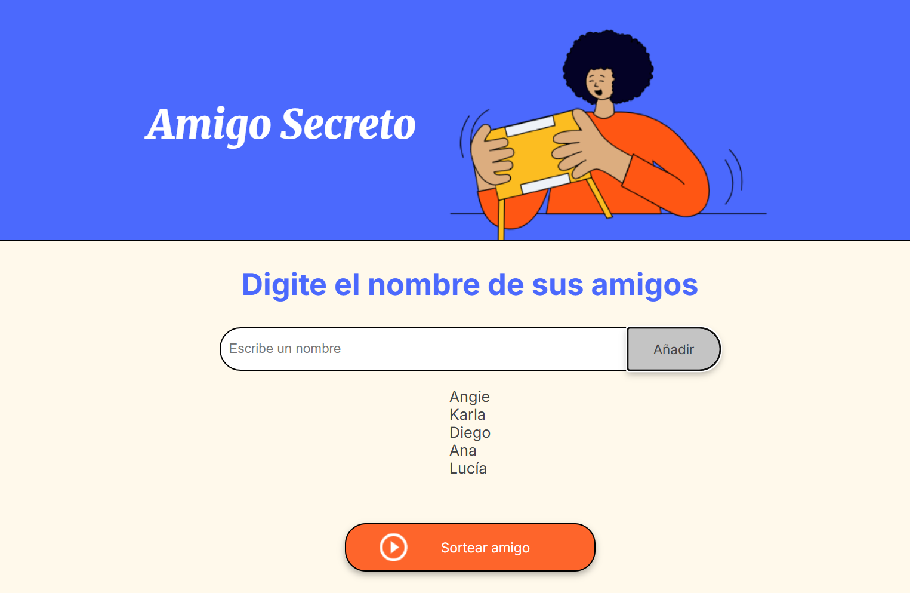
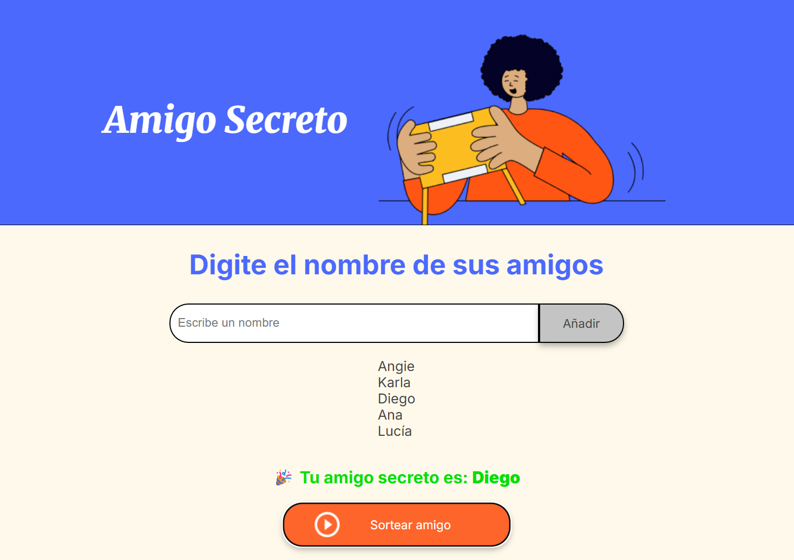

# 🎁 Challenge Amigo Secreto

Este proyecto lo desarrollé como parte de un desafío de **lógica de programación**.  
La idea es sencilla pero divertida: escribir los nombres de tus amigos en una lista y luego hacer un **sorteo aleatorio** para descubrir quién será el “amigo secreto”.  

---

## 🚀 Funcionalidades
- Agregar amigos a una lista.  
- Validar nombres (que no estén vacíos ni repetidos).  
- Mostrar en pantalla todos los amigos agregados.  
- Hacer un sorteo totalmente aleatorio.  
- Mostrar el resultado del sorteo directamente en la interfaz.  

---

## 🛠️ Tecnologías usadas
- **HTML5**  
- **CSS3**  
- **JavaScript Vanilla** (puro, sin frameworks)  

---

## 📸 Capturas de pantalla
_Aquí irán imágenes de ejemplo del proyecto en acción._  

👉 Lista de amigos agregados:  
  

👉 Resultado del sorteo:  
  

---

## ▶️ Cómo ejecutar el proyecto
1. Abre tu terminal y clona este repositorio en tu máquina:  
   ```bash
   git clone https://github.com/aangiepr/challenge-amigo-secreto.git
   ```
2. Ingresa a la carpeta del proyecto:  
   ```bash
   cd challenge-amigo-secreto
   ```
3. Abre el archivo `index.html` en tu navegador.  
4. Empieza a agregar nombres y haz tu primer sorteo 🎉  

---

## ✨ Sobre mí
Soy **Angie** y este proyecto es parte de mi camino de aprendizaje en programación.  
Lo hice con mucho entusiasmo porque me encanta poner en práctica lo que voy aprendiendo y ver cómo una idea se convierte en algo real y funcional 🚀.